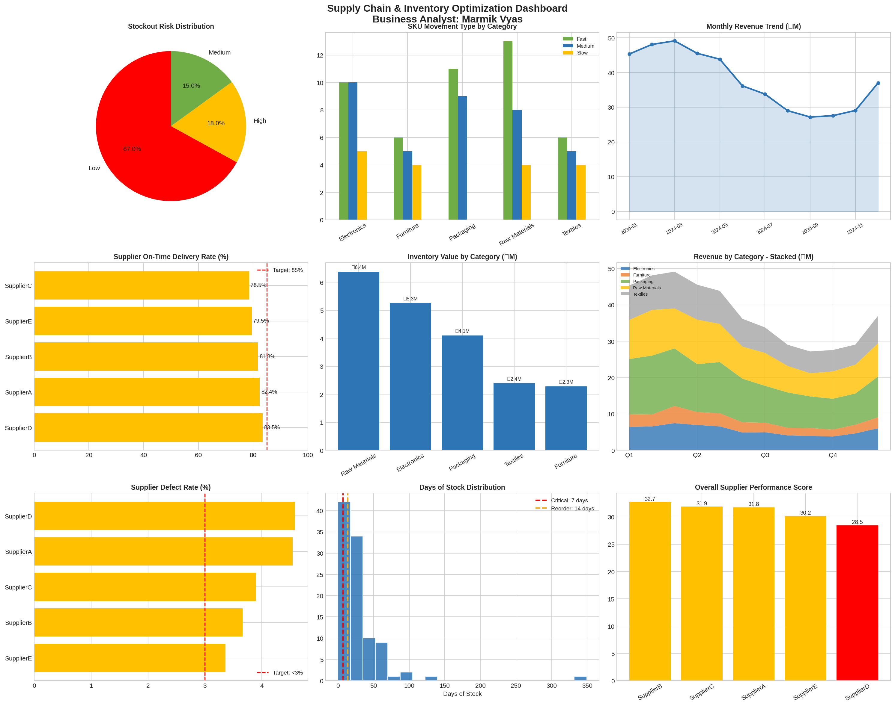

# 📦 Supply Chain & Inventory Optimization Dashboard

> **Role:** Business Analyst · Data Analyst
> **Tools:** Python · Pandas · Matplotlib · Seaborn · Power BI (ready)
> **Domain:** Manufacturing / Export Operations

---

## 🧩 Business Problem

An export manufacturing company managing 100+ SKUs across 5 supplier relationships needed to:
- Reduce inventory holding costs (₹1.6M/month in excess stock)
- Minimise stockout risk before it impacts order fulfilment
- Evaluate supplier performance objectively across delivery, defects, and lead time
- Replace manual Excel-based reporting with a real-time KPI dashboard

As the Business Analyst on this project, I defined the KPI framework, designed the analysis logic, and delivered data-ready outputs for Power BI integration.

---

## 🎯 BA Approach

| Phase | What I Did |
|-------|-----------|
| **Requirements** | Defined KPIs with operations team: OTD rate, days-of-stock, defect %, stockout risk |
| **Analysis** | Built stockout risk matrix using 14-day lead time logic; segmented SKUs by movement type |
| **Supplier Scorecard** | Weighted scoring model: 50% OTD + defect penalty + lead time variance |
| **Visualisation** | 9-panel KPI dashboard across inventory health, sales trends, and supplier performance |
| **Output** | CSV datasets exported for Power BI; dashboard ready for weekly leadership reviews |

---

## 📊 Key Findings

| KPI | Value |
|-----|-------|
| Total Inventory Value | ₹20.4M |
| Monthly Holding Cost | ₹1.6M |
| High Stockout Risk SKUs | 18 (18% of portfolio) |
| Slow-Moving SKUs | 17 (representing tied-up capital) |
| Total Revenue (YTD) | ₹451.9M |
| Best Performing Supplier | SupplierB (OTD: 81.8%, Score: 32.74) |
| Supplier Needing Review | SupplierD (Score: 28.49 — flagged for improvement) |

---

## 📁 Repository Structure

```
supply-chain-inventory-analysis/
│
├── supply_chain_analysis.py       # Full analysis code (data gen → KPIs → dashboard)
├── supply_chain_dashboard.png     # 9-panel KPI dashboard
├── inventory_data.csv             # 100 SKU inventory dataset
├── sales_data.csv                 # 12-month daily sales by category
├── supplier_data.csv              # Monthly supplier performance data
├── supplier_scorecard.csv         # Weighted supplier scorecard output
└── README.md
```

---

## 🔍 Dashboard Preview



**Panels include:**
- Stockout Risk Distribution (pie)
- SKU Movement Type by Category (bar)
- Monthly Revenue Trend (line)
- Supplier OTD Rate vs 85% target (horizontal bar)
- Inventory Value by Category
- Revenue by Category — stacked area
- Supplier Defect Rate vs 3% threshold
- Days of Stock Distribution (histogram)
- Overall Supplier Performance Score

---

## 🛠️ How to Run

```bash
# Install dependencies
pip install pandas numpy matplotlib seaborn

# Run the analysis
python supply_chain_analysis.py
```

The script will:
1. Generate a realistic 100-SKU inventory dataset
2. Create a 12-month sales time series
3. Build supplier performance metrics
4. Output the 9-panel dashboard PNG
5. Export all data as CSVs for Power BI

---

## 💡 Business Recommendations Delivered

1. **Immediate reorder** for 18 high-risk SKUs (< 7 days stock remaining)
2. **Renegotiate terms with SupplierD** — lowest performance score (28.49), high lead time variance
3. **Reduce slow-mover overstock** — 17 SKUs driving unnecessary holding costs
4. **Shift procurement calendar** — align orders to seasonal demand peaks (Q2/Q4 spikes visible in trend)

---

## 🏷️ Tags
`business-analyst` `supply-chain` `inventory-management` `kpi-dashboard` `python` `pandas` `matplotlib` `power-bi` `supplier-scorecard` `operations-analytics`
